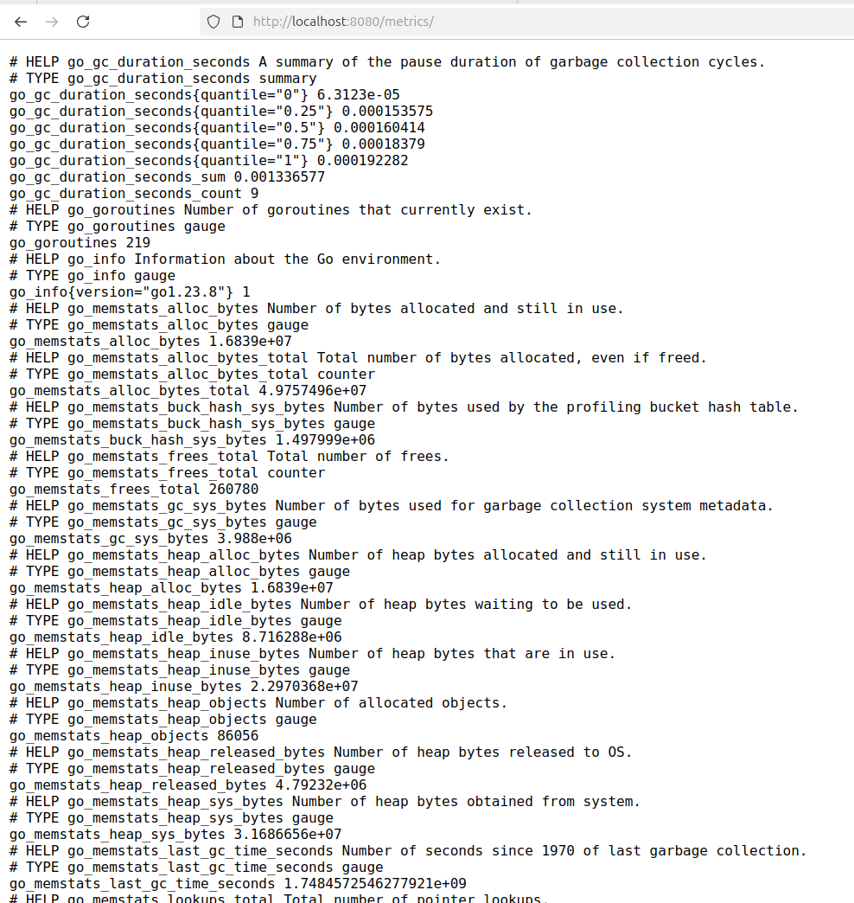
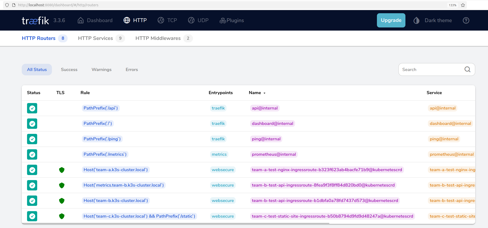
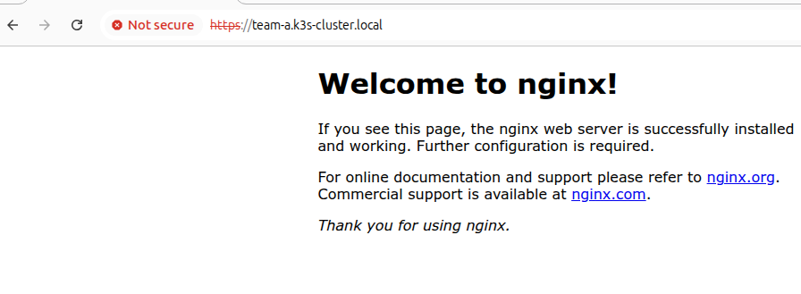
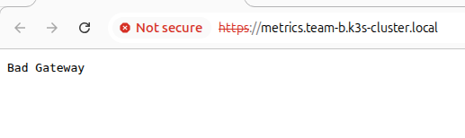
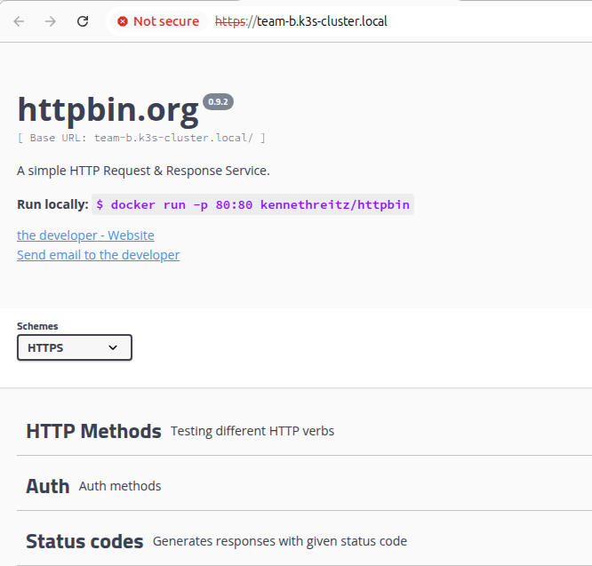
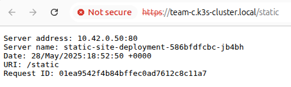
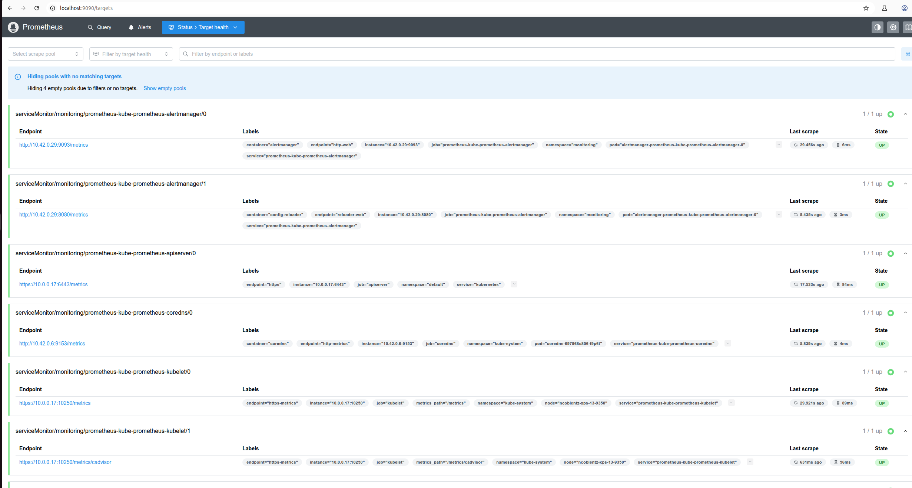
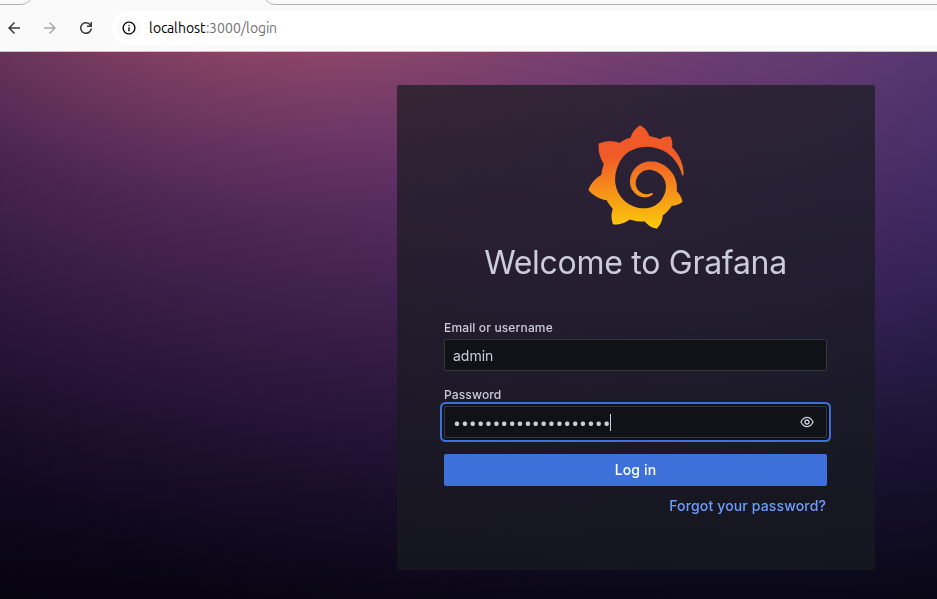
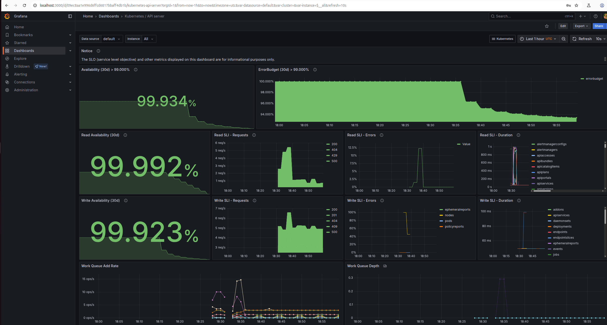
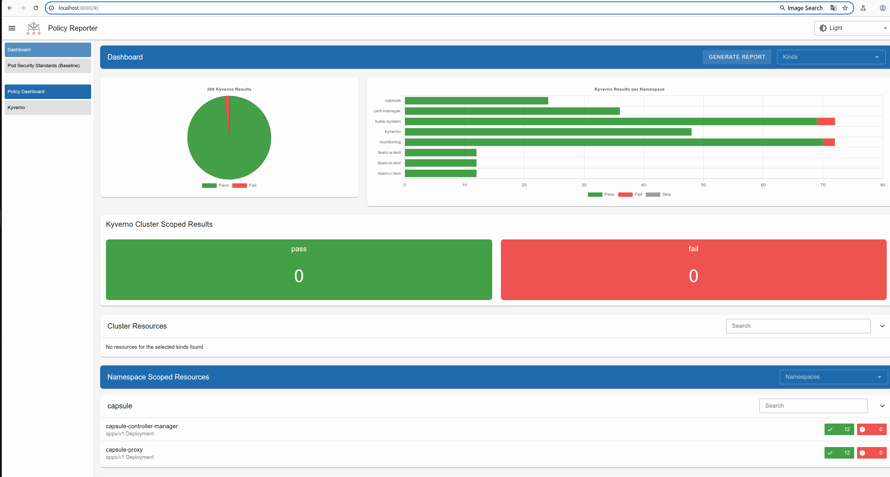

<!-- TOC -->
* [Multi-Tenant K3s Kubernetes Cluster Install and Setup](#multi-tenant-k3s-kubernetes-cluster-install-and-setup)
  * [Scenario](#scenario)
  * [Overview](#overview)
  * [Single Node Local K3S Cluster Installation](#single-node-local-k3s-cluster-installation)
    * [Install K3s](#install-k3s)
    * [Veruf Access to the Cluster using `kubectl`](#veruf-access-to-the-cluster-using-kubectl)
    * [Create an Admin Service Account and Kube Config](#create-an-admin-service-account-and-kube-config)
    * [Create a Read-Only Service Account](#create-a-read-only-service-account)
    * [Switch Between `kubectl` Contexts](#switch-between-kubectl-contexts)
    * [Start/Stop Daemon](#startstop-daemon)
    * [Uninstall K3s (for reference)](#uninstall-k3s-for-reference)
    * [Install Cluster Services via Helm](#install-cluster-services-via-helm)
      * [Configure Traefik - Already Installed by K3s](#configure-traefik---already-installed-by-k3s)
      * [Cert-Manager](#cert-manager)
      * [Prometheus](#prometheus)
      * [Kyverno](#kyverno)
      * [Capsule - install last](#capsule---install-last)
      * [Get All Installed Helm Charts](#get-all-installed-helm-charts)
    * [Get to Cluster Services](#get-to-cluster-services)
      * [Traefik](#traefik)
      * [Team Workloads](#team-workloads)
      * [Prometheus](#prometheus-1)
      * [Grafana](#grafana)
      * [Kyverno](#kyverno-1)
<!-- TOC -->

# Multi-Tenant K3s Kubernetes Cluster Install and Setup

This document provides step-by-step instructions for setting up a multi-tenant Kubernetes environment using K3s.

> **Note**
> This guide assumes you have already reviewed the main project `README` and have all the required prerequisites installed on a Debian-based Linux distribution (e.g., Ubuntu).

---

## Scenario

Your organization has many development groups that use Kubernetes to deploy and expose their services. Instead of each team creating, managing, and securing its own cluster, your organization has decided to create one centralized cluster managed by a platform team.

However, development groups must not have free rein in the cluster. They need to be isolated so one team cannot access another's workloads. Likewise, their workloads must be isolated. Finally, development teams should only have access to a defined subset of cluster services. This lab demonstrates a common configuration used to achieve this goal but includes built in security vulnerabilities.

---

## Overview

This lab environment includes:

- **K3s**: A lightweight, CNCF-certified Kubernetes distribution.
- **Multi-tenancy**: Namespace isolation through Capsule with three example tenants.
- **Security**: Kyverno policy enforcement with the `restricted` Pod Security Standard.
- **Monitoring**: Prometheus and Grafana integration for observability.
- **Ingress**: Traefik Ingress controller (pre-installed with K3s).
- **Certificates**: Automatic certificate generation with cert-manager.

---


## Single Node Local K3S Cluster Installation

### Install K3s

First, update your system's package repositories and install K3s.

```bash
  sudo apt update && sudo apt upgrade
  curl -sfL https://get.k3s.io | sh -
```
After installation, verify that the K3s service is active and running.
```bash
  systemctl status k3s
● k3s.service - Lightweight Kubernetes
     Loaded: loaded (/etc/systemd/system/k3s.service; enabled; preset: enabled)
     Active: active (running) since Mon 2025-05-26 10:45:31 CDT; 17s ago
 Invocation: 03abb44649b940368904f660bf1adb28
       Docs: https://k3s.io
    Process: 1406445 ExecStartPre=/bin/sh -xc ! /usr/bin/systemctl is-enabled --quiet nm-cloud-setup.service 2>/dev/null (code=exited, status=0/SUCCESS)
    Process: 1406447 ExecStartPre=/sbin/modprobe br_netfilter (code=exited, status=0/SUCCESS)
    Process: 1406450 ExecStartPre=/sbin/modprobe overlay (code=exited, status=0/SUCCESS)
   Main PID: 1406452 (k3s-server)
      Tasks: 93
     Memory: 1.4G (peak: 1.4G)
        CPU: 18.704s
     CGroup: /system.slice/k3s.service
             ├─1406452 "/usr/local/bin/k3s server"
             ├─1406484 "containerd "
             ├─1407332 /var/lib/rancher/k3s/data/f10c229b8445ff9999c26495950a5c8b2e08fd13f1889d38f994edeebf026236/bin/containerd-shim-runc-v2 -namespace k8s.io -id 826d44e79593430e9fae5421a4a541667187ae20d000ee72f5d92624d545b2b4 -address /run/k3s/>
             ├─1407362 /var/lib/rancher/k3s/data/f10c229b8445ff9999c26495950a5c8b2e08fd13f1889d38f994edeebf026236/bin/containerd-shim-runc-v2 -namespace k8s.io -id 826fb4ddd11d31d3746b5c3a58fe1c8bbef47b28127d226e940442abcc30aaa6 -address /run/k3s/>
             ├─1407366 /var/lib/rancher/k3s/data/f10c229b8445ff9999c26495950a5c8b2e08fd13f1889d38f994edeebf026236/bin/containerd-shim-runc-v2 -namespace k8s.io -id 70bed0395e64a521547690375a394a5528d4a323838b0b0cd71ce55e35d1de6d -address /run/k3s/>
             ├─1408337 /var/lib/rancher/k3s/data/f10c229b8445ff9999c26495950a5c8b2e08fd13f1889d38f994edeebf026236/bin/containerd-shim-runc-v2 -namespace k8s.io -id 2a3a7855caa4d1dec336eb03ec678121500be150f0bd2d04cebca7e53bd93511 -address /run/k3s/>
             └─1408431 /var/lib/rancher/k3s/data/f10c229b8445ff9999c26495950a5c8b2e08fd13f1889d38f994edeebf026236/bin/containerd-shim-runc-v2 -namespace k8s.io -id 321f2a2f135770c35ac4efff7c56659977e37ca3b7ee4bc2b35f6d2447e65039 -address /run/k3s/>

May 26 10:45:45 XPS-13-9350 k3s[1406452]: I0526 10:45:45.603629 1406452 reconciler_common.go:299] "Volume detached for volume \"values\" (UniqueName: \"kubernetes.io/projected/f8766a24-eca6-45ef-9db2-87b54c4615a9-values\") on node \"ncob>
May 26 10:45:45 XPS-13-9350 k3s[1406452]: I0526 10:45:45.603635 1406452 reconciler_common.go:299] "Volume detached for volume \"tmp\" (UniqueName: \"kubernetes.io/empty-dir/f8766a24-eca6-45ef-9db2-87b54c4615a9-tmp\") on node \">
May 26 10:45:46 XPS-13-9350 k3s[1406452]: I0526 10:45:46.292345 1406452 pod_container_deletor.go:80] "Container not found in pod's containers" containerID="b3ddf8522479c88d20be31dc7cdb0e4fe3424ce19ab0f2ae9617a66b796846b7"
May 26 10:45:46 XPS-13-9350 k3s[1406452]: I0526 10:45:46.317378 1406452 job_controller.go:598] "enqueueing job" key="kube-system/helm-install-traefik" delay="1s"
May 26 10:45:46 XPS-13-9350 k3s[1406452]: I0526 10:45:46.322329 1406452 job_controller.go:598] "enqueueing job" key="kube-system/helm-install-traefik" delay="1s"
May 26 10:45:46 XPS-13-9350 k3s[1406452]: I0526 10:45:46.325362 1406452 event.go:389] "Event occurred" object="kube-system/traefik" fieldPath="" kind="HelmChart" apiVersion="helm.cattle.io/v1" type="Normal" reason="ApplyJob" message="App>
May 26 10:45:46 XPS-13-9350 k3s[1406452]: I0526 10:45:46.337630 1406452 event.go:389] "Event occurred" object="kube-system/traefik" fieldPath="" kind="HelmChart" apiVersion="helm.cattle.io/v1" type="Normal" reason="ApplyJob" message="App>
May 26 10:45:47 XPS-13-9350 k3s[1406452]: I0526 10:45:47.302260 1406452 replica_set.go:679] "Finished syncing" kind="ReplicaSet" key="kube-system/traefik-c98fdf6fb" duration="56.494µs"
May 26 10:45:47 XPS-13-9350 k3s[1406452]: I0526 10:45:47.302376 1406452 pod_startup_latency_tracker.go:104] "Observed pod startup duration" pod="kube-system/traefik-c98fdf6fb-5btk6" podStartSLOduration=1.531844016 podStartE2EDuration="4.>
May 26 10:45:47 XPS-13-9350 k3s[1406452]: I0526 10:45:47.313031 1406452 event.go:389] "Event occurred" object="kube-system/traefik" fieldPath="" kind="Service" apiVersion="v1" type="Normal" reason="UpdatedLoadBalancer" message="Updated L>
lines 1-31/31 (END)
```

### Verify Access to the Cluster using `kubectl`
```bash
  sudo kubectl --kubeconfig /etc/rancher/k3s/k3s.yaml get nodes
AME                    STATUS   ROLES                  AGE     VERSION
xps-13-9350   Ready    control-plane,master   6m37s   v1.32.5+k3s1
```

### Create an Admin Service Account and Kube Config

```bash    
  sudo kubectl --kubeconfig /etc/rancher/k3s/k3s.yaml apply -f install/new-service-account.yaml
  TOKEN=$(sudo kubectl --kubeconfig /etc/rancher/k3s/k3s.yaml create token my-admin-sa -n platform-team --duration=8760h)
  K3S_SERVER_IP=$(sudo kubectl --kubeconfig /etc/rancher/k3s/k3s.yaml config view --minify -o jsonpath='{.clusters[0].cluster.server}')
  K3S_CA_DATA=$(sudo kubectl --kubeconfig /etc/rancher/k3s/k3s.yaml config view --flatten -o jsonpath='{.clusters[0].cluster.certificate-authority-data}')
  export KUBECONFIG=~/.kube/config
  mkdir -p ~/.kube
  echo "${K3S_CA_DATA}" | base64 -d > ~/.kube/k3s-ca.crt
  kubectl config set-cluster k3s-cluster   --server="${K3S_SERVER_IP}"   --certificate-authority="${HOME}/.kube/k3s-ca.crt"   --embed-certs=true
  kubectl config set-credentials my-admin-sa-user   --token="${TOKEN}"
  kubectl config set-context my-admin-sa-context   --cluster=k3s-cluster   --user=my-admin-sa-user   --namespace=default
  kubectl config use-context my-admin-sa-context
  kubectl get nodes
NAME                    STATUS   ROLES                  AGE   VERSION
xps-13-9350   Ready    control-plane,master   27m   v1.32.5+k3s1
```

### Create a Read-Only Service Account

```bash
  sudo kubectl --kubeconfig /etc/rancher/k3s/k3s.yaml apply -f install/read-only-sa.yaml
  TOKEN=$(sudo kubectl --kubeconfig /etc/rancher/k3s/k3s.yaml create token -n platform-team my-readonly-sa --duration=8760h)
  export KUBECONFIG=~/.kube/config
  kubectl config set-credentials read-only-sa-user   --token="${TOKEN}"
  kubectl config set-context my-readonly-sa-context   --cluster=k3s-cluster   --user=read-only-sa-user   --namespace=default
```

### Switch Between `kubectl` Contexts

```bash
  kubectl config get-contexts
  kubectl config use-context my-readonly-sa-context # choose read only user or
  kubectl config use-context my-admin-sa-context # choose admin user
```

### Start/Stop Daemon

Prevent It From Starting by Default on Boot
```bash
  systemctl disable k3s
```

Status
```bash
  systemctl status k3s
```

Start
```bash
  systemctl start k3s
```

Stop

```bash
  systemctl stop k3s
```

### Uninstall K3s (for reference)

```bash
  /usr/local/bin/k3s-uninstall.sh
```

### Install Cluster Services via Helm

#### Configure Traefik - Already Installed by K3s

K3s already has Traefik installed as a helm package. They have a special way to "upgrade" that helm package by dropping a new `values.yaml` file in a special diretory.

```bash
  sudo cp install/traefik-custom-config.yaml /var/lib/rancher/k3s/server/manifests/
```

#### Cert-Manager
```bash
  helm repo add jetstack https://charts.jetstack.io
  helm repo update
  helm search repo cert-manager #check the latest version and use it below
  helm show values jetstack/cert-manager
  helm install cert-manager jetstack/cert-manager --create-namespace --namespace cert-manager  -f install/cert-manager-values.yaml # check latest version 
  helm get values cert-manager -n cert-manager
  kubectl get pods -n cert-manager -w
  kubectl get secrets cert-manager-webhook-ca -n cert-manager -o jsonpath='{.data.tls\.crt}' | base64 --decode > install/internal-ca.crt
```
#### Prometheus

```bash
  helm repo add prometheus-community https://prometheus-community.github.io/helm-charts
  helm repo update
  helm search repo prometheus
  helm install prometheus prometheus-community/kube-prometheus-stack --create-namespace --namespace monitoring -f install/prometheus-values.yaml 
  helm get values prometheus -n monitoring
Get Grafana 'admin' user password by running:

  kubectl --namespace monitoring get secrets prometheus-grafana -o jsonpath="{.data.admin-password}" | base64 -d ; echo

Access Grafana local instance:

  export POD_NAME=$(kubectl --namespace monitoring get pod -l "app.kubernetes.io/name=grafana,app.kubernetes.io/instance=prometheus" -oname)
  kubectl --namespace monitoring port-forward $POD_NAME 3000

  kubectl --namespace monitoring get pods -l "release=prometheus"
  kubectl --namespace monitoring get secrets prometheus-grafana -o jsonpath="{.data.admin-password}" | base64 -d ; echo

https://github.com/prometheus-community/helm-charts/tree/main/charts/prometheus#scraping-pod-metrics-via-annotations
```

#### Kyverno

Kyverno:

```bash
  helm repo add kyverno https://kyverno.github.io/kyverno/
  helm repo update
  helm install kyverno kyverno/kyverno --namespace kyverno --create-namespace  --set webhooks.allowPrivilegeEscalation=false  --set webhooks.runAsNonRoot=true  --set webhooks.privileged=false --set webhooks.seccompProfile.type=RuntimeDefault --set webhooks.capabilities.drop={ALL} --set webhooks.readOnlyRootFilesystem=true --set failurePolicy=Fail --set metrics.enabled=true --set podSecurityStandard=restricted
  helm install kyverno-policies kyverno/kyverno-policies -n kyverno --create-namespace
  helm upgrade kyverno-policies kyverno/kyverno-policies -n kyverno -f install/kyverno-policies-values.yaml #after making a change to the policy file
  kubectl get pods -n kyverno
  #kubectl apply -f install/kyverno.yaml
  kubectl get clusterpolicy -o wide
```
Policy Reporter:
```bash
  helm repo add policy-reporter https://kyverno.github.io/policy-reporter
  helm repo update
  helm install policy-reporter policy-reporter/policy-reporter --create-namespace -n policy-reporter -f install/policy-reporter-values.yaml
```

#### Capsule - install last

```bash
  helm repo add projectcapsule https://projectcapsule.github.io/charts/
  helm install capsule projectcapsule/capsule --create-namespace --namespace capsule -f install/capsule-values.yaml
  helm status capsule -n capsule
  kubectl logs -f deployment/capsule-controller-manager -c manager -n capsule
  # Post Install setup
  kubectl create namespace tenant-system
  kubectl apply -f install/tenants.yaml
  kubectl create serviceaccount alice-sa -n tenant-system
  kubectl create serviceaccount bob-sa -n tenant-system
  kubectl create serviceaccount charlie-sa -n tenant-system
  TOKEN=$(kubectl create token alice-sa -n tenant-system --duration=8760h) # 1 year duration
  kubectl config set-credentials alice-sa-user   --token="${TOKEN}"
  kubectl config set-context alice-sa-context   --cluster=k3s-cluster   --user=alice-sa-user   --namespace=team-a
  TOKEN=$(kubectl create token bob-sa -n tenant-system --duration=8760h) # 1 year duration
  kubectl config set-credentials bob-sa-user   --token="${TOKEN}"
  kubectl config set-context bob-sa-context   --cluster=k3s-cluster   --user=bob-sa-user   --namespace=team-b
  TOKEN=$(kubectl create token charlie-sa -n tenant-system --duration=8760h) # 1 year duration
  kubectl config set-credentials charlie-sa-user   --token="${TOKEN}"
  kubectl config set-context charlie-sa-context   --cluster=k3s-cluster   --user=charlie-sa-user   --namespace=team-c
  kubectl config use-context alice-sa-context && kubectl create namespace team-a-test && kubectl apply -f install/alice-workload.yaml
  kubectl config use-context bob-sa-context && kubectl create namespace team-b-test && kubectl apply -f install/bob-workload.yaml
  kubectl config use-context charlie-sa-context && kubectl create namespace team-c-test && kubectl apply -f install/charlie-workload.yaml
  kubectl config use-context my-admin-sa-context 
```


#### Get All Installed Helm Charts

```bash
  helm list -A
```

---

### Get to Cluster Services

#### Traefik

Resource: https://k3s.rocks/traefik-dashboard/#expose-traefik-dashboard

Metrics:
- `kubectl -n kube-system port-forward deployments/traefik 8080:9100`
- Visit http://127.0.0.1:8080/metrics/



Dashboard:
- `kubectl -n kube-system port-forward deployments/traefik 8080:8080`
- Visit http://127.0.0.1:8080/dashboard/



- http://localhost:8080/ping/

#### Team Workloads

```bash
  EXTIP=$(kubectl get -n kube-system svc traefik -o jsonpath='{.status.loadBalancer.ingress[0].ip}')
  echo "$EXTIP team-a.k3s-cluster.local metrics.team-b.k3s-cluster.local team-b.k3s-cluster.local team-c.k3s-cluster.local"| sudo tee -a /etc/hosts
```

Visit the application URLs in your browser:
- **Team A:** https://team-a.k3s-cluster.local/
- **Team B (Metrics):** https://metrics.team-b.k3s-cluster.local
- **Team B (App):** https://team-b.k3s-cluster.local
- **Team C:** https://team-c.k3s-cluster.local/static






#### Prometheus

```bash
  kubectl -n monitoring port-forward service/prometheus-operated 9090:9090
```

Visit:
- http://localhost:9090/query



#### Grafana

```bash
  kubectl -n monitoring port-forward service/prometheus-grafana 3000:80
```

Visit:
- http://localhost:3000/login
    - Username: admin
    - Password: your-strong-password (modify this in install/prometheus-values.yaml)





#### Kyverno

```bash
  kubectl -n policy-reporter port-forward services/policy-reporter-ui 8080:8080
```

Visit:
- http://localhost:8080/#/


